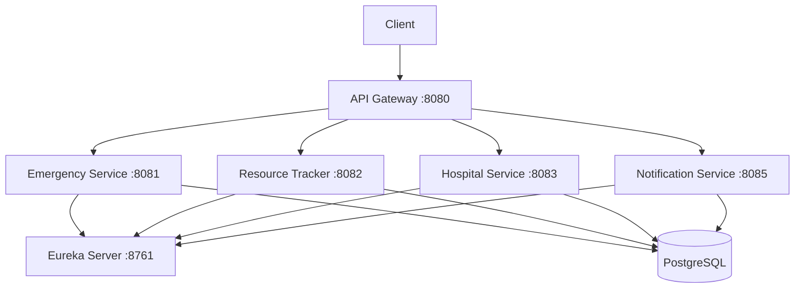

# Emergency Alert System
A robust, real-time coordination platform designed for critical incident management, fire safety monitoring, and emergency response.


---

## 🚀 Overview
In emergency situations, every second counts. This Emergency Alert System provides a centralized hub for managing fire safety, medical alerts, and security incidents. Built on a **Spring Boot Microservices** backend with a React frontend, it replaces manual coordination with automated dispatch, real-time tracking, and instant notifications.

> 💡 **Real Problem:** India's average ambulance response time is 15-20 minutes vs WHO recommended 8-10 minutes. This system automates coordination to reduce delays.

---

## ✨ Features
- 🚨 **SOS Trigger:** One-click emergency case creation with auto ambulance assignment
- 🚑 **Smart Dispatch:** Nearest ambulance found using Haversine formula (GPS-based)
- 🏥 **Hospital Bed Tracking:** Real-time bed availability across hospitals
- 📍 **Live Resource Tracking:** Ambulance GPS location updates
- 🔔 **Instant Notifications:** SMS/Email alerts on emergency events
- 📋 **Role-Based Dashboards:** Admin, Responder, and Officer views
- 📝 **Incident Logging:** Automated timestamping and audit history

---

## 🛠 Tech Stack

| Category | Technology |
| :--- | :--- |
| **Backend** | Java 17, Spring Boot 3.1.5 |
| **Microservices** | Spring Cloud, Eureka, API Gateway |
| **Database** | PostgreSQL |
| **Frontend Framework** | React.js |
| **Language** | TypeScript |
| **Styling** | Tailwind CSS |
| **State Management** | React Hooks (Context API) |
| **Icons** | Lucide React |
| **Build Tool** | Maven |

---

## 🏗 Architecture


### Microservices Breakdown

| Service | Port | Responsibility |
| :--- | :--- | :--- |
| **Eureka Server** | 8761 | Service Registry & Discovery |
| **API Gateway** | 8080 | Single Entry Point, Routing |
| **Emergency Service** | 8081 | SOS, Case Management |
| **Resource Tracker** | 8082 | Ambulance GPS, Nearest Dispatch |
| **Hospital Service** | 8083 | Bed Availability, Nearest Hospital |
| **Notification Service** | 8085 | SMS/Email Alerts |

---

## 📂 Project Structure
```
Emergency-alert-system/
├── eureka-server/           # Service Registry
├── api-gateway/             # API Gateway
├── emergency-service/       # Core SOS & Case Management
│   ├── controller/
│   ├── service/
│   ├── repository/
│   ├── model/
│   └── dto/
├── resource-tracker-service/ # Ambulance GPS Tracking
├── hospital-service/        # Hospital Bed Management
├── notification-service/    # Alert Notifications
└── frontend/                # React Dashboard (Coming Soon)
```

---

## 📡 API Endpoints

### Emergency Service
| Method | Endpoint | Description |
|--------|----------|-------------|
| POST | /api/emergency/sos | 🚨 Trigger SOS |
| GET | /api/emergency | Get all cases |
| GET | /api/emergency/{id} | Get case by ID |
| PATCH | /api/emergency/{id}/status | Update status |
| PATCH | /api/emergency/{id}/assign-ambulance | Assign ambulance |
| PATCH | /api/emergency/{id}/assign-hospital | Assign hospital |

### Resource Tracker
| Method | Endpoint | Description |
|--------|----------|-------------|
| POST | /api/resources | Register ambulance |
| GET | /api/resources/nearest?latitude=x&longitude=y | 🗺️ Find nearest |
| PATCH | /api/resources/{id}/location | Update GPS |
| PATCH | /api/resources/{id}/status | Update status |

### Hospital Service
| Method | Endpoint | Description |
|--------|----------|-------------|
| POST | /api/hospitals | Add hospital |
| GET | /api/hospitals/available-beds | 🛏️ Available beds |
| GET | /api/hospitals/nearest?latitude=x&longitude=y | Nearest hospital |
| PATCH | /api/hospitals/{id}/beds | Update bed count |

---

## ⚙️ Installation

### Prerequisites
- Java 17+
- PostgreSQL
- Maven
- Node.js (for frontend)

### Backend Setup

1. Clone the repository:
```bash
git clone https://github.com/vaibhavidhenge23/Emergency-alert-system.git
cd Emergency-alert-system
```

2. Create PostgreSQL databases:
```sql
CREATE DATABASE emergency_db;
CREATE DATABASE resource_tracker_db;
CREATE DATABASE hospital_db;
CREATE DATABASE notification_db;
```

3. Start services in order:
```bash
# 1. Eureka Server
cd eureka-server && mvn spring-boot:run

# 2. API Gateway
cd api-gateway && mvn spring-boot:run

# 3. All microservices
cd emergency-service && mvn spring-boot:run
cd resource-tracker-service && mvn spring-boot:run
cd hospital-service && mvn spring-boot:run
cd notification-service && mvn spring-boot:run
```

4. Verify at: `http://localhost:8761`

---

## 🖥 Usage

After launching:

- **SOS Trigger:** `POST /api/emergency/sos` with caller details and location
- **Register Ambulance:** `POST /api/resources` with vehicle and GPS info
- **Add Hospital:** `POST /api/hospitals` with bed count and location
- **Find Nearest:** `GET /api/resources/nearest?latitude=21.14&longitude=79.08`

---

## 🌐 Contributing

Pull requests are welcome! For major changes, please open an issue first.or production deployments:VariableDescriptionREACT_APP_EMERGENCY_CONTACTPrimary contact number for emergency servicesREACT_APP_REGION_CODELocalization code for regional safety protocols📸 Demo(Add screenshots of the Emergency Dashboard and Alert Trigger screen here)🤝 ContributingThis is a safety-oriented project. For major changes, please open an issue first to discuss your proposal.Fork the Project.Create your Feature Branch (git checkout -b feature/NewAlertSystem).Commit your changes.Push to the Branch.Open a Pull Request.🗺 Roadmap[ ] Real-time SMS/Push notifications via Twilio integration.[ ] Live geolocation tracking for responders on a map view.[ ] Offline-first support for areas with poor connectivity.[ ] IoT integration for automated fire sensor triggers.📄 LicenseThis project is licensed under the MIT License.d
